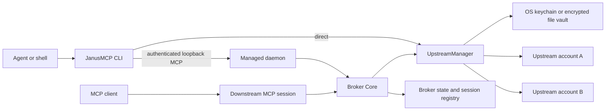

# JanusMCP architecture

JanusMCP is a local, multi-account credential and tool broker. It speaks MCP to upstream
servers and to MCP clients, and exposes the same discovery/call capabilities as a direct CLI.
There is no hosted backend or telemetry service.

## System view

The CLI and downstream MCP server are two surfaces over the same account configuration,
credential resolver, MCP SDK, and upstream semantics. The daemon is an optional persistence
boundary for repeated CLI calls, not a replacement protocol.

## Components

| Component | Responsibility | Source |
|---|---|---|
| Command entrypoint | Dispatches CLI, MCP server, UI, install, and daemon commands | `go/cmd/janusmcp/main.go` |
| CLI access | Discovers schemas and invokes tools through direct or daemon routing | `go/cmd/janusmcp/tools.go`, `daemon_client.go` |
| Managed daemon | Owns lifecycle, loopback listener, bearer authentication, and metadata | `go/cmd/janusmcp/daemon.go` |
| Broker Core | Creates downstream MCP sessions and control tools | `go/internal/broker/server.go` |
| UpstreamManager | Lazily opens per-account MCP sessions and caches tool definitions | `go/internal/broker/upstream.go` |
| BrokerState | Persists the global selector and tracks session-local selection | `go/internal/broker/state.go` |
| Config | Validates accounts, profiles, transports, and binding mode | `go/internal/config/config.go` |
| OAuth and vault | Resolves credentials at connection time and stores secrets locally | `go/internal/oauth/`, `go/internal/vault/` |

## Runtime paths

### MCP client path

An MCP client connects over stdio or Streamable HTTP. JanusMCP creates a downstream session,
registers the `janus_*` control tools, exposes the selected account/profile tools, and routes
calls through `UpstreamManager`. Switching a selector refreshes the session tool set and emits
the MCP tool-list change notification.

### Direct CLI path

`tools`, `schema`, and `call` load the same configuration and credential stack, create a
one-shot `UpstreamManager`, perform the operation, and close the upstream sessions. Raw output
is the human-compatible default; `--json` adds the machine contract.

### Managed daemon path

The daemon holds a Broker Core and `UpstreamManager` across CLI invocations. Each CLI command
opens a temporary authenticated MCP HTTP session to the daemon. Explicit selectors have
session scope, so a command does not mutate the global active selector. In automatic mode, an
absent, unhealthy, incompatible, or locked daemon falls back to the direct path.

## Selection and routing

Selectors resolve to one account or to all accounts in a profile. Precedence is:

1. explicit per-call selector;
2. session-local selector;
3. persisted global selector;
4. configured default account.

`bindingMode=global` permits persistent global switching, `session` isolates downstream
sessions, and `locked` rejects switching. Profile tool-name collisions are namespaced so a call
has one deterministic owner.

## Persistence

- Configuration contains account metadata and secret references, not token values.
- OAuth and vault secrets remain in the OS keychain or encrypted file-vault fallback.
- Global active state is atomically persisted with owner-only permissions.
- Daemon metadata stores PID, endpoint, random token, version, configuration identity, start
  time, and log path under the OS configuration directory with owner-only permissions.
- Upstream sessions and tool caches are in memory and disappear when their owning process exits.

## Trust boundaries and invariants

- JanusMCP binds local HTTP services to loopback unless the user explicitly configures the
  ordinary MCP HTTP server differently.
- Managed daemon MCP, health, and shutdown endpoints always require its bearer token.
- Bearer tokens, OAuth tokens, vault values, and resolved secret environment variables must not
  enter logs or model-visible tool output.
- MCP remains the upstream protocol and the downstream client contract.
- Direct CLI mode remains available even when daemon state is stale or incompatible.
- CLI JSON, timeout, error, and raw-output behavior must be identical across direct and daemon
  routes.

See the [compatibility contract](compatibility.md), [security policy](../SECURITY.md), and
[ADRs](adr/README.md) before changing these boundaries.
